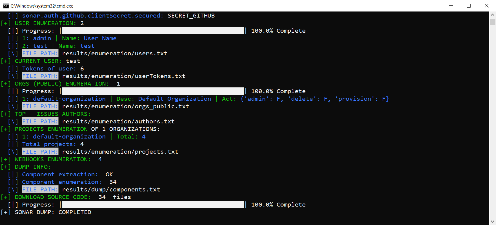
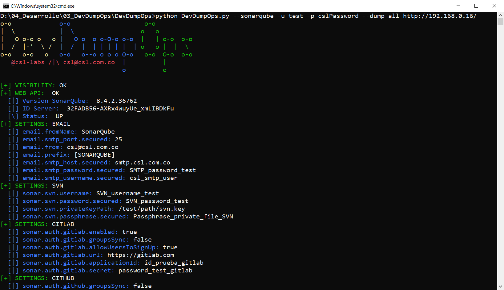
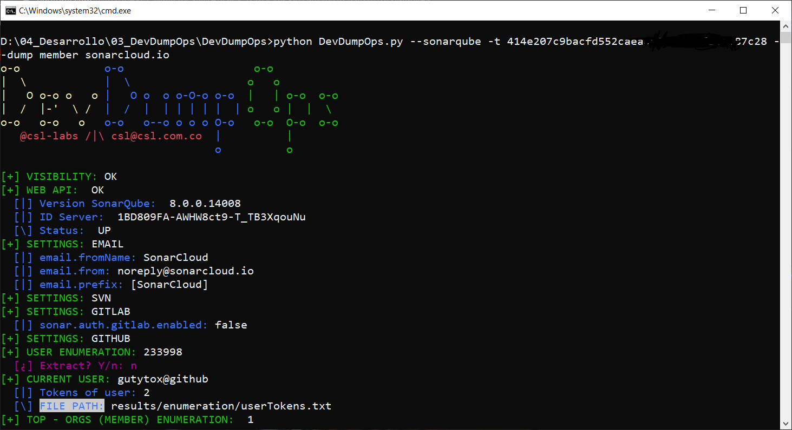

# DevDumpOps
🛠️ In construction 🛠️

Open Source tool for the information dump of DevOps platforms, focused on the abuse of Tokens, APIS and exposed service accounts that allow us to consult these development tools; From a security perspective, it is very useful and convenient to be able to reconstruct the source code, extract configuration files, deployment data and as much information as possible from these platforms, for subsequent intrusion processes.

### Installation 🔧
```
git clone https://github.com/CSL-LABS/DevDumpOps.git
cd DevDumpOps
```

### Usage
```
python DevDumpOps.py --help
```

### Target's
- **Sonarqube**
- otros ~~en construccion~~

## Actions
### Enumeration 📋
Enumerates the SonarQube server configuration, as well as permissions, organizations, projects, and code components visible with or without credentials.

### Dump
All visible code components are downloaded and stored:
- all
    - The code of all projects
- member 
    - The code linked to the credentials (useful for SonarCloud.io)

### Hack ~~In construction ~~

## Usage examples
- Enumeration without using credentials: 
```
python DevDumpOps.py --sonarqube [target]
```

- Download code for public projects: 
```
python DevDumpOps.py --sonarqube --dump all [target]
```


- Enumeration using credentials:
```
python DevDumpOps.py --sonarqube -u admin -p admin [target]
```


- Download code for private projects:
```
python DevDumpOps.py --sonarqube -u admin -p admin --dump member [target]
```

- Download code in SonarCloud projects: 
```
python DevDumpOps.py --sonarqube -t [token] --dump member sonarcloud.io
```


## Results

The results are stored by default in the /results/ folder or in the one defined under the --output option, and the following information is found:
- Configuration SMTP, GITHUB, GITLAB Y SVN
- Identified users
- Visible projects
- Downloaded code
- Code components
- Extracted WebHooks
- User Tokens

## References
- https://csl.com.co/sonarqube-auditando-al-auditor-parte-i/
- https://csl.com.co/sonarqube-auditando-al-auditor-parte-ii/ 