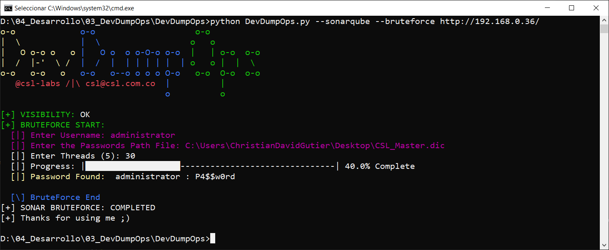

# DevDumpOps
🛠️ En construcción 🛠️

Herramienta Open Source para el Dump de información de plataformas DevOps, enfocado al abuso de Tokens, APIS y cuentas de servicio expuestas que nos permitan la consulta a estas herramientas de desarrollo; desde una perspectiva de seguridad es muy útil y conveniente poder reconstruir el código fuente, extraer archivos de configuración, datos de despliegue y la mayor información posible de estas plataformas, para posteriores procesos de intrusión. 

### Instalación 🔧
```
git clone https://github.com/CSL-LABS/DevDumpOps.git
cd DevDumpOps
```

### Uso
```
python DevDumpOps.py --help
```

### Target's
- **Sonarqube**
- otros ~~en construccion~~

## Actions
### Enumeration 📋
Realiza una enumeración de la configuración del servidor SonarQube, así como de los permisos, organizaciones, proyectos y componentes de código visisible con o sin credenciales. 
### Dump
Se descarga y almacena la totalidad de los componentes de código visibles: 
- all
    - Todo el código
- member 
    - El código enlazado a las credenciales (util para SonarCloud.io)
### Bruteforce
Realiza un ataque de fuerza bruta sobre el sistema de Login, utilizando los siguiente parametros: 
- Usuario a atacar.
- Ruta del diccionario.
- Cantidad de threads a utilizar.

### Backdoor
Selecciona uno de los siguientes modos de persistencia, es necesario contar con privilegios previos: 
1. Crear nuevo usuario. 
2. Generar un nuevo token.
3. Elevar privilegios a un usuario.
4. Cambiar la contraseña de un usuario. 

## Ejemplos de uso
- **Enumeración sin utilizar credenciales**: 
```
python DevDumpOps.py --sonarqube [target]
```

- **Descarga de código de los proyectos publicos**: 
```
python DevDumpOps.py --sonarqube --dump all [target]
```


- **Enumeración utilizando credenciales**:
```
python DevDumpOps.py --sonarqube -u admin -p admin [target]
```


- **Descarga de código de los proyectos privados**:
```
python DevDumpOps.py --sonarqube -u admin -p admin --dump member [target]
```

- **Descarga de codigo en proyectos SonarCloud**: 
```
python DevDumpOps.py --sonarqube -t [token] --dump member sonarcloud.io
```


- **Ataque de Fuerza Bruta**:
```
python DevDumpOps.py --sonarqube --bruteforce [target]
```
Usuario: administrator



- **Generar Persistencia: Genera un nuevo token**
Es importante recordar que los token's no caducan, por tanto así cambien la contraseña del usuario el token continuará siendo valido. 
```
python DevDumpOps.py --sonarqube --backdoor -u administrator -p P4$$w0rd [target]
```
Opcion: 2


## Resultados
Los resultados son almacenados por defecto en la carpeta /results/ o en la que se defina bajo la opcion --output, y se encuentra la siguiente informacion: 
- Configuracion SMTP, GITHUB, GITLAB Y SVN.
- Usuarios identificados.
- Proyectos visibles.
- Codigo descargado.
- Componentes de código.
- WebHooks extraidos.
- Tokens de Usuario.

## Referencias
- https://csl.com.co/sonarqube-auditando-al-auditor-parte-i/
- https://csl.com.co/sonarqube-auditando-al-auditor-parte-ii/ 